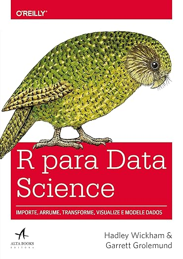

<!-- Capa do livro (fundo transparente) -->

  

<h1 align="center">Grupo de Estudos — R para Ciência de Dados (2ª ed.)</h1>

  Encontros semanais às <strong>segunda, 20–21h</strong> (America/Sao_Paulo) para estudar o livro capítulo a capítulo.

---

## 📖 Objetivo
Ler e discutir o <em>R para Ciência de Dados</em> (2ª edição), praticando o fluxo completo de ciência de dados no R (visualizar, transformar, importar, programar e comunicar) com o ecossistema tidyverse. Baseado na tradução oficial PT da 2ª ed. disponível gratuitamente on-line. [https://pt.r4ds.hadley.nz/](https://pt.r4ds.hadley.nz/)

## 🗓️ Encontros
- **Quando:** segundas, **20h–21h**  
- **Formato:** online (Google Meet)  
- **Ritmo sugerido:** 1 capítulo/semana  
> Pauta por encontro: Abertura (5–10 min) · Discussão (30–40 min) · Encerramento (10–15 min)

## 🤝 Combinados
- Respeito e colaboração; todas as perguntas são bem-vindas.  
- Leia o capítulo (ou parte) antes do encontro.  
- Traga 1 insight ou 1 snippet para compartilharmos.

---

## 🧷 Prefácio — visão geral
A 2ª edição reforça o foco em habilidades práticas de ciência de dados no R (gráficos, programação letrada e reprodutibilidade), organizando o conteúdo em cinco eixos: **visualizar**, **transformar**, **importar**, **programar** e **comunicar**. A tradução PT é um esforço colaborativo da comunidade. *Resumo autoral para fins de estudo.* 

---

## ✅ Checklist de progresso (2ª edição)
Marque com **[x]** conforme avançar. Títulos conforme a **tradução PT**.

- [ ] **Prefácio da segunda edição**
- [ ] **Introdução**
- [ ] **Cap. 01 — Visualização de dados**
- [ ] **Cap. 02 — Fluxo de Trabalho: básico**
- [ ] **Cap. 03 — Transformação de dados**
- [ ] **Cap. 04 — Fluxo de trabalho: estilo de código**
- [ ] **Cap. 05 — Organização de dados (data tidying)**
- [ ] **Cap. 06 — Fluxo de trabalho: scripts e projetos**
- [ ] **Cap. 07 — Importação de dados**
- [ ] **Cap. 08 — Fluxo de trabalho: obtendo ajuda**
- [ ] **Cap. 09 — Camadas**
- [ ] **Cap. 10 — Análise exploratória de dados**
- [ ] **Cap. 11 — Comunicação**
- [ ] **Cap. 12 — Vetores lógicos**
- [ ] **Cap. 13 — Números**
- [ ] **Cap. 14 — Strings**
- [ ] **Cap. 15 — Expressões regulares**
- [ ] **Cap. 16 — Fatores**
- [ ] **Cap. 17 — Datas e horários**
- [ ] **Cap. 18 — Valores faltantes**
- [ ] **Cap. 19 — Uniões (joins)**
- [ ] **Cap. 20 — Planilhas**
- [ ] **Cap. 21 — Bancos de dados**
- [ ] **Cap. 22 — Arrow**
- [ ] **Cap. 23 — Dados hierárquicos (rectangling)**
- [ ] **Cap. 24 — Raspagem de dados (Web scraping)**
- [ ] **Cap. 25 — Funções**
- [ ] **Cap. 26 — Iteração**
- [ ] **Cap. 27 — Um guia para o R base**
- [ ] **Cap. 28 — Quarto**
- [ ] **Cap. 29 — Formatos para Quarto**

> Baseado no índice oficial PT da 2ª edição. 
---

## 📚 Materiais úteis
- Livro on-line (PT): *R para Ciência de Dados (2ª ed.)*. :contentReference[oaicite:3]{index=3}  
- Livro on-line (EN): *R for Data Science (2e)*. :contentReference[oaicite:4]{index=4}  
- Repositório da tradução PT (GitHub). :contentReference[oaicite:5]{index=5}

---

## 👥 Autores
**Hadley Wickham · Mine Çetinkaya-Rundel · Garrett Grolemund** — autores de *R for Data Science (2e)*, referência prática para trabalhar dados com R e tidyverse. :contentReference[oaicite:6]{index=6}

  

---

## ⚖️ Nota de uso
Repositório para **estudo**. Respeite direitos autorais: não publique trechos integrais do livro; concentre-se em anotações autorais e exemplos próprios.
